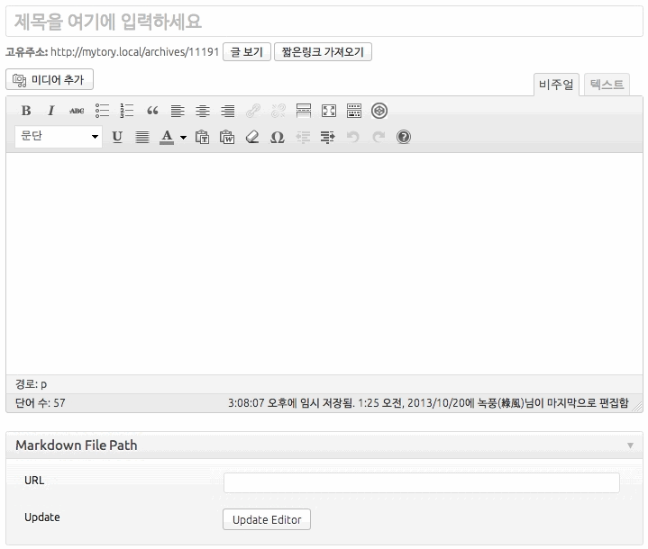

# Mytory Markdown

This plugin get markdown file path on dropbox public link, convert markdown to html, and put it to post content.

## Logic

This plugin get dropbox md content. And save header's etag to postmeta and converted html to post_content. Next time on request same post, first this plugin olny get dropbox http etag. If changed etag, get dropbox md content and save again, or get html from post_content.

## This plugin divide title and content from md file.

If markdown file has `h1` this plugin puts first `h1` string to post_title. Of course, remove the `h1` from post_content so don't print title twice.